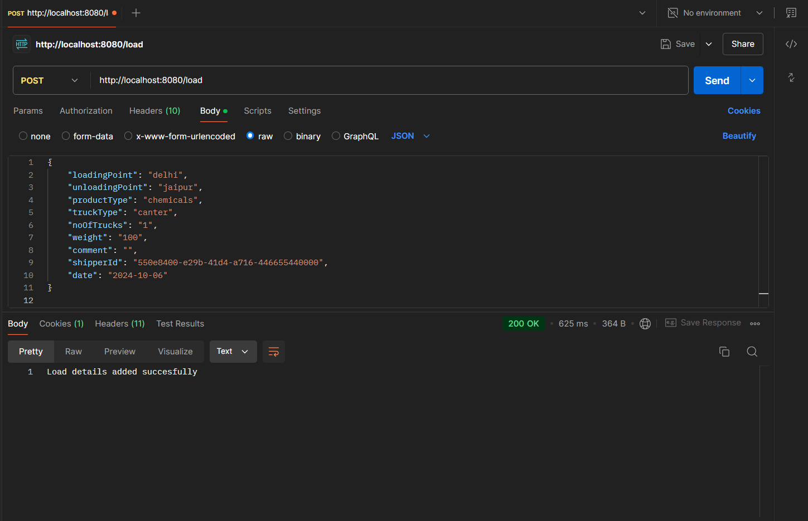
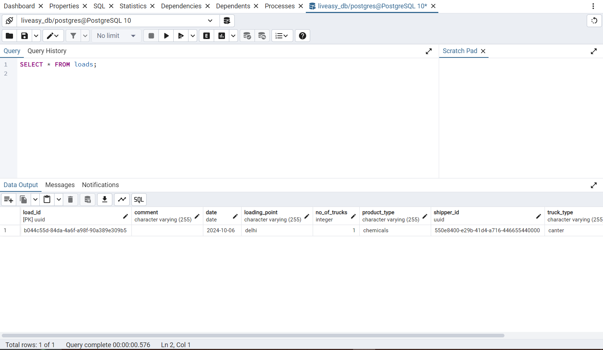
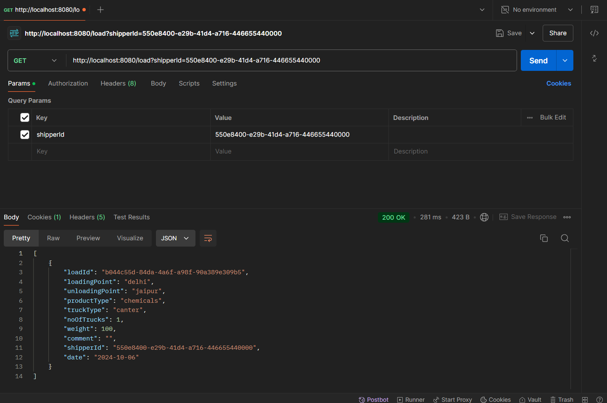
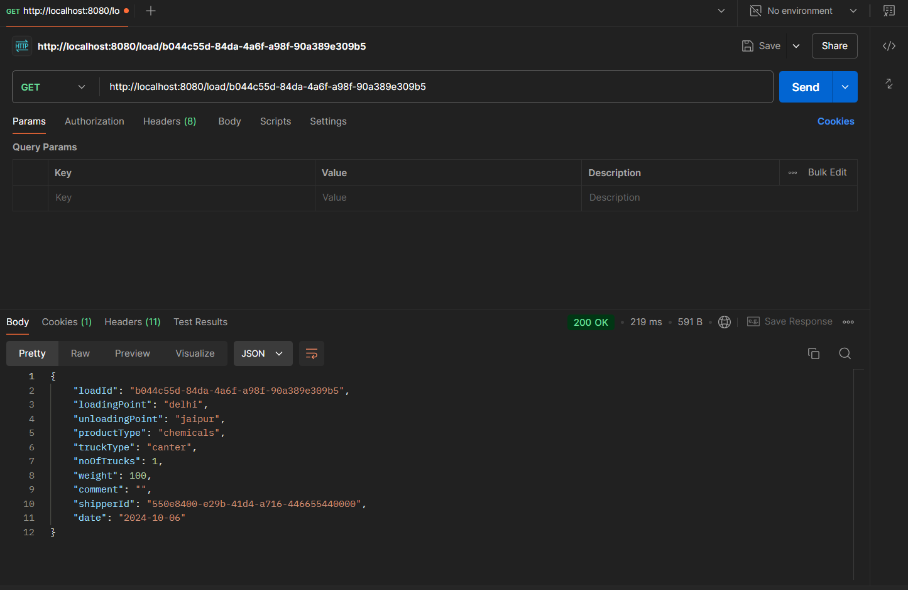
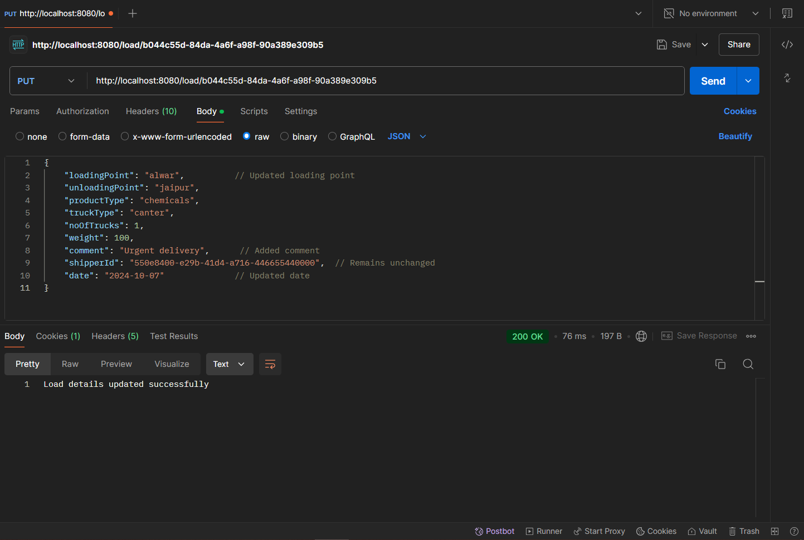
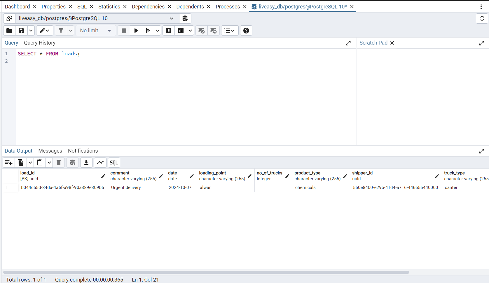
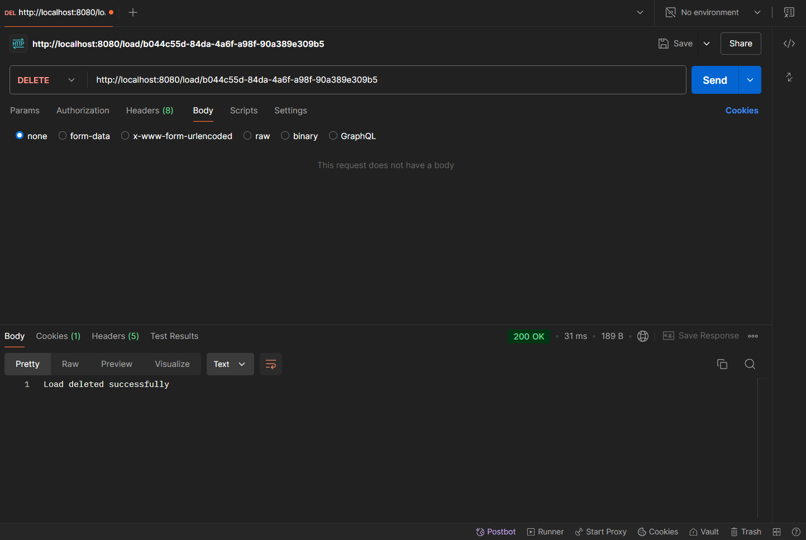
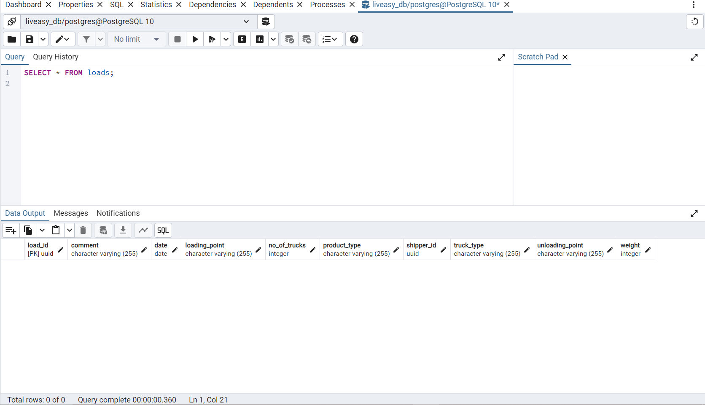

# Liveasy Transport Operations API

This project is aimed at creating a set of REST APIs for managing transport operations in the Liveasy app. These APIs interact with a PostgreSQL database to perform CRUD (Create, Read, Update, Delete) operations, enabling users to store and retrieve transport-related data.

# Project Overview
The backend of this project is developed using the Spring Boot framework, which provides robust support for building REST APIs. The project uses PostgreSQL as the database to store and manage transport data, leveraging Spring Data JPA to handle database operations seamlessly.

# Features
REST API Development: Built a suite of RESTful endpoints to perform CRUD operations for transport data.

Spring Boot Integration: Utilized Spring Boot’s built-in features like dependency injection, configuration management, and more.

PostgreSQL Database: Connected the API to a PostgreSQL database, using Spring Data JPA for efficient data management.

API Testing: Tested the API endpoints using Postman to ensure proper functionality and error handling.

# Technologies Used
Spring Boot: For creating and managing RESTful APIs.

PostgreSQL: Database used for storing transport-related data.

Spring Data JPA: For easy integration with the PostgreSQL database.

Postman: Used for testing and verifying the API endpoints.

# API Endpoints
HTTP Method	Endpoint	Description

POST	/load	Adds new load data

GET	/load	Retrieves all load data

GET /load/{loadId} Retrives load data with specific ID

PUT	/load/{loadId}	Updates existing load data by ID

DELETE	/load/{loadId}	Deletes load data by ID

# Installation and Setup
Clone the repository:
 git clone <repository-url>

Navigate to the project directory:
 cd liveasy-transport-api
 
Install the dependencies and build the project:
 mvn clean install

Configure the PostgreSQL database connection in application.properties:
spring.datasource.url=jdbc:postgresql://localhost:5432/your-db
spring.datasource.username=your-username
spring.datasource.password=your-password

Run the application:
 mvn spring-boot:run
 
# Access the API through Postman or your preferred HTTP client at:
http://localhost:8080/load

# Result Screenshots
Here are some screenshots showing successful CRUD operations:

POST request: Adding new load data

GET request: Retrieving all load data & Retrives load data with specific ID

PUT request: Updating load data by ID

DELETE request: Deleting load data by ID

